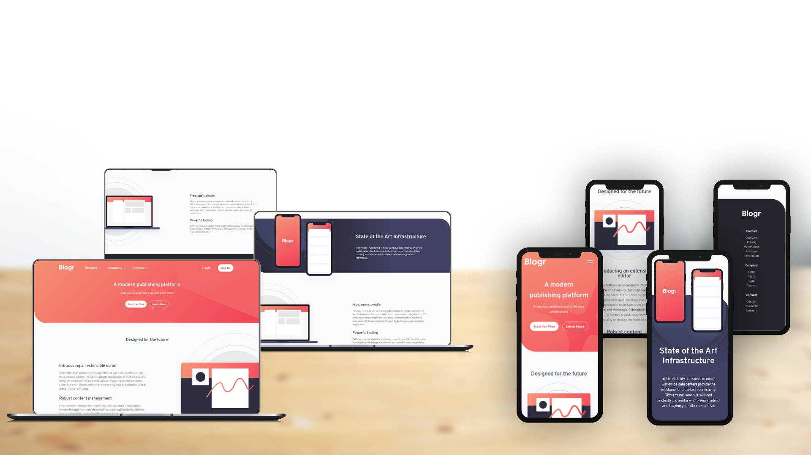

# Blogr landing page

This is a solution to the [Blogr landing page challenge on Frontend Mentor](https://www.frontendmentor.io/challenges/blogr-landing-page-EX2RLAApP). Frontend Mentor challenges help you improve your coding skills by building realistic projects. 

## Table of contents

- [Blogr landing page](#blogr-landing-page)
  - [Table of contents](#table-of-contents)
  - [Overview](#overview)
    - [The challenge](#the-challenge)
    - [Screenshot](#screenshot)
    - [Links](#links)
  - [Front-end Style Guide](#front-end-style-guide)
    - [Layout](#layout)
    - [Colors](#colors)
    - [Typography](#typography)
    - [Fonts](#fonts)
  - [My process](#my-process)
    - [Built with](#built-with)
  - [Author](#author)

## Overview

### The challenge

Users should be able to:

- View the optimal layout for the site depending on their device's screen size
- See hover states for all interactive elements on the page

### Screenshot

### Links

- Live Site URL: [https://benjaminvillatte.github.io/fem-blogr-landing-page/](https://benjaminvillatte.github.io/fem-blogr-landing-page/)

## Front-end Style Guide

### Layout

The designs were created to the following widths:

- Mobile: 375px
- Desktop: 1440px

### Colors

_Primary_

- Light red (CTA text): hsl(356, 100%, 66%)
- Very light red (CTA hover background): hsl(355, 100%, 74%)
- Very dark blue (headings): hsl(208, 49%, 24%)

_Neutral_

- White (text): hsl(0, 0%, 100%)
- Grayish blue (footer text): hsl(240, 2%, 79%)
- Very dark grayish blue (body copy): hsl(207, 13%, 34%)
- Very dark black blue (footer background): hsl(240, 10%, 16%)

_Gradient_

Background gradient - Intro/CTA mobile nav:

- Very light red: hsl(13, 100%, 72%)
- Light red: hsl(353, 100%, 62%)

Background gradient - body:

- Very dark gray blue: hsl(237, 17%, 21%)
- Very dark desaturated blue: hsl(237, 23%, 32%)

### Typography

- Font size: 16px

### Fonts

- Family: [Overpass](https://fonts.google.com/specimen/Overpass?preview.text_type=custom)
- Weights: 300, 600

- Family: [Ubuntu](https://fonts.google.com/specimen/Ubuntu?preview.text_type=custom)
- Weights: 400, 500, 700

## My process

### Built with

- Semantic HTML5 markup
- CSS custom properties
- Flexbox
- CSS Grid
- Mobile-first workflow
- Vitejs from development and production build

## Author

- Website - [Benjamin VILLATTE](https://www.benjaminvillatte.fr)
